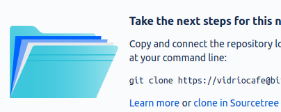
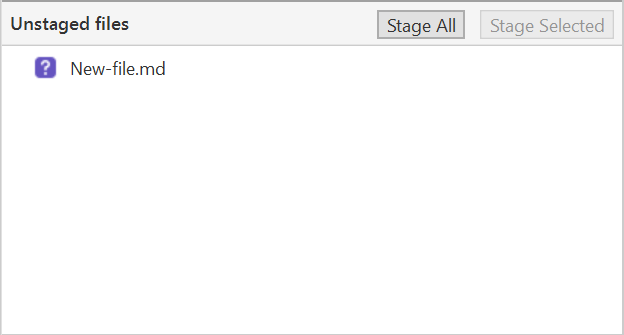

# Git basics

Some kind of source control is a must for collaboration, and Git is a great choice. It's powerful enough to manage extremely complicated software projects, and can be a very simple way to manage documentation or other content. 

If you're working with a big team, working on a fast-moving project, or have simultaneous development on many parts of a project at the same time, Git lets you create *branches* to keep people out of each other's way. 

On the other hand, if you're doing the kind of collaboration where two people are rarely working on the same piece at the same time, or where quality control can be a bit informal, you can use Git without branching at all. This might seem strange to seasoned Git users, who are accustomed to creating branches all the time, but even without branching Git is a lot safer than accidentally overwriting other people's changes on a shared server, emailing a document around, or any of the other rickety ways that people work informally with documents.

The only recipe in this guide that uses Git branching is [Managing docs with Gitflow](/recipes/recipes-gitflow/), which attempts to show decent branching strategy in an easy way.

The other recipes that use Git don't use branching, meaning that when you are [taking notes](../../recipes/recipes-notes), [editing a wiki](../../recipes/recipes-git-wiki), or [collaborating on simple documents](../../recipes/recipes-distributed-workflow), your work looks like this:

1. Open your favorite Git client and click [**Pull**](#pull).
2. Work on your documents in your favorite Markdown editor.
3. From time to time, in your Git client, type a short sentence about what you've done and click [**Commit**](#stage-and-commit).
4. When your work is final, click [**Push**](#push).

That's all there is to it. Branching has a couple extra steps, but we'll leave that for  [Managing docs with Gitflow](/recipes/recipes-gitflow/). 


## Install Git

If you don't already have Git set up on your computer, follow these steps.


1. Install Git on your computer:
    - [Windows](https://git-scm.com/download/win)
    - [macOS](https://git-scm.com/download/mac)
    - [Linux](https://git-scm.com/download/linux)
1. Install a git client such as  [Sourcetree](https://www.sourcetreeapp.com/).

!!! hint
    You can use any Git client with any Git host, but some clients work especially well
    with specific hosts. For example:
    
    - Sourcetree and Bitbucket
    - GitHub Desktop and GitHub


## Set up a repository

A *repository* is where you keep your work. There are many approaches to creating a repository. One easy way is to create the repository online  and *clone* it (create a local copy). The steps are similar for different Git hosts and clients. Here is what those steps look like in Bitbucket and Sourcetree:

1. Sign up with a Git host such as [Bitbucket](https://bitbucket.org/).
2. In a browser, log on to Bitbucket (or your preferred host).
2. Click the new repository button (the plus sign):  
   
3. Type a repository name, make sure it's set to be a public repository, and 
   click **Create repository**.
4. Choose or create a directory on your computer where you would like to keep your local 
copy of the project.
5. Click **Clone in Sourcetree**.  
   
6. Make sure the correct repository is going to the correct folder on your computer,
   and click **Clone**.

It might not look like much has happened, but you now have:

- Git running on your computer
- A repository at an online Git host
- A local copy of the repository on your computer

## How to Git

### Practice good Git habits

A good Git workflow looks like this:

1. **Make sure you're on the right branch.** Even if you're working on a project with no branches, get in the habit of checking. That way, when you do work on more complicated projects, you won't have to fix something you did on the wrong branch by accident.
2. **Pull before you start working.** Pulling every so often keeps you up to date with other people's changes, reducing the likelihood that you will run into complicated merge conflicts later on. 
3. **Stage and commit fairly often.** *Staging* files means deciding which ones to commit. Most of the time, there's no reason not to stage all changed files and commit them to your local repository frequently. Every commit is a point you can roll back to, giving you plenty of power to back out changes if necessary.
4. **Push when your work is ready for review.** *Pushing* files up to the local repository makes them available to others, so it's kindest not to push until your work is in good shape. In projects that use branching, a push is not the final step; after pushing people can review your work before it is pushed into production. If your project only has one branch, then when you push that's it.

### Branching

Although it's possible to use Git without doing any branches, it's unusual. To learn the basics of a simple Git branching workflow, see [Manage docs with GitHub Flow](../../recipes/recipes-gitflow/).


### Pull

The Git pull command fetches and downloads content from your remote repository, automatically merges the changes with your local repository, and updates everything so that your repository matches the latest version of everything on the remote. It's a good idea to pull after making sure you're on the right branch and before starting to work on the content. 

=== "Sourcetree"

    1. Make sure you're on the right branch in the correct repository:
        - The bold text under **Branches** tells you the branch
        - The tab at the top of the screen tells you the repository
    1. Select **Repository > Pull** or click the **Pull** button.  
       

=== "GitHub Desktop"

    In GitHub Desktop, you can *fetch* and *pull* separately. Fetch gets the latest
    updates from origin but doesn't update your local working copy
    with the changes. After you click **Fetch origin**, the button changes to 
    **Pull Origin**.
    
    1. Make sure you're on the right branch in the correct repository:
        - The bold text under **Current branch** tells you the branch
        - The bold text under **Current repository** tells you the repository
    1. Select **Repository > Pull** or:  
        1. Click the **Fetch origin** button.  
             
        1. Click the **Pull origin** button.  
             

=== "Linux command line"
    1. Make sure you're on the right branch in the correct repository:
    ```
    $ git branch
    * master
    $ git remote -v
    origin	https://github.com/pconrad-fb/markdown.git (fetch)
    origin	https://github.com/pconrad-fb/markdown.git (push)
    ```
    1. Type the `git pull` command:
    ```
    $ git pull
    ```

### Stage and commit

Git knows when you make changes to your files. When you want to save those changes to Git, you must do two things:

- *stage* them, which tells Git which changes you intend to keep
- *commit* them, which saves the changes.

=== "Sourcetree"
    In Sourcetree, you stage and commit your files in two operations.
    
    1. Make sure you're on the right branch in the correct repository.
    1. Look for the files you changed in the Unstaged files pane. Select
       the files you want to stage&mdash;in most cases, you can just click 
       **Stage All.**  
       
    1. Make sure you see the right files in the Staged files pane.  
       
    1. Type a short commit message and click **Commit**.  
       

=== "GitHub Desktop"
    In GitHub Desktop, you can stage and commit your files in one step.
    
    1. Make sure you're on the right branch in the correct repository.
    1. Look for the files you changed in the Changes tab. Unselect any files you don't
       want to change&mdash;most of the time, you can leave all the checkboxes checked.  
       
    1. Type a short commit message.
    1. Make sure the **Commit** button refers to the correct branch
       ("Commit to master," for example).
    1. Click **Commit to [branch]**.

=== "Linux command line"
    You can stage, commit and add a commit message all in one line.
    
    1. Make sure you're on the right branch in the correct repository.
    1. Stage and commit the changes, adding a descriptive message:
    ```
    $ git commit -am "Type your descriptinve message here."
    ```


### Push

=== "Sourcetree"
    
    1. Make sure you're on the right branch in the correct repository.  
    1. Select **Repository > Push** or click the **Push** button.  
       


=== "GitHub Desktop"
     
    1. Make sure you're on the right branch in the correct repository.
    1. Select **Repository > Push** or click the **Push origin** button.  
       

=== "Linux command line"

    1. Make sure you're on the right branch in the correct repository.
    1. Push, specifying the remote (usually `origin`) and the branch. For the 
       recipes where you are working on the master branch, the command looks
       like this:
       ```
       $ git push origin master
       ```
       Of course, since git knows what branch you're on and where your remote is, you
       can often just type ``git push`.


## Next steps

Try setting up a [Git wiki](../recipes-git-wiki).