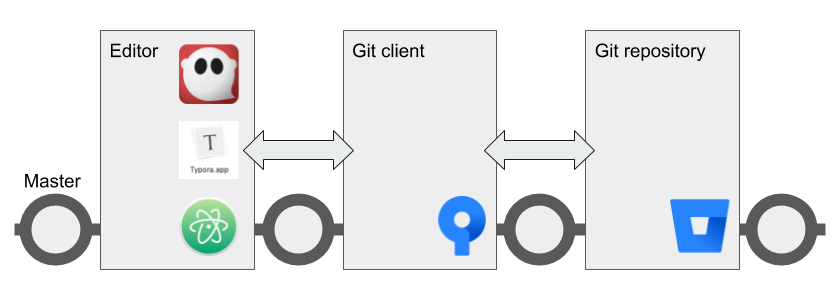

# Collaborate using centralized Git workflow

You can use Git to help a team collaborate on informal or internal documents in a very simple way. If you use a graphical Git client and a WYSIWYG Markdown editor, the workflow is easy for people who like things simple. At the same time, Markdown in Git is powerful enough for engineers and integrates with their tools.

The centralized workflow can be an effective way for content creators, managers, and engineers to collaborate on non-production content such as specifications, planning documents, newsletters, internal documentation, and the like.

In this workflow, everyone works on the same branch. This makes things easy for simple collaboration.

!!! Note
    If you're publishing a large website or documentation set in a production 
    environment with with a substantial number of
    collaborators, you should consider using [GitHub Flow](../recipes-gitflow/) instead.

## Ingredients

<table>
  <tr>
    <td><b><a href="../../tools/tools-editors/">Markdown editor</a></b></td>
  </tr>
  <tr>
    <td><b><a href="../../tools/tools-git-setup/">Git</a></b></td>
  </tr>
    <tr>
    <td><b><a href="../../tools/tools-publishing/">Publishing tools</a></b> (optional)</td>
  </tr>
</table>

!!! hint
    Plan ahead based on the publishing tool you want to use. 
    If you're planning to use a wiki, MkDocs, or Hugo, organize your docs in 
    [Git wiki structure](../../tools/tools-publishing#git-wiki-structure) and
    add YAML frontmatter from the start. If you're creating large documents with
    Pandoc, think about whether you need to work on content in pieces and 
    then use Pandoc to assemble everything.
    
## Working with content

This recipe uses the centralized Git workflow. [Pick an editor](../../tools/tools-editors/), then make sure you have Git set up and try each step below. The steps work together like a heartbeat that keeps content safe and synchronized for all collaborators.

--8<-- "centralized-workflow-snippet.html"

If you need to [Publish content](../../tools/tools-publishing/), you can use one of these recipes:

+ [Publish documentation with MkDocs](../recipes-mkdocs/)
+ [Publish a website with Hugo](../recipes-mkdocs/)
+ [Create a document with Pandoc](../recipes-pandoc/)

!!! hint
    Remember not to publish content into a Git repository. The repo is only for storing
    your Markdown and other source files.

## Next steps

Check out the following recipes  :

- [Manage docs with Gitflow](../recipes-gitflow/)
- [Create an eBook](../recipes-pandoc-ebook/)
- [Write a Word doc](../recipes-pandoc-word/)
- [Publish a PDF](../recipes-pandoc-pdf/)
- [Present slides](../recipes-slides/)
