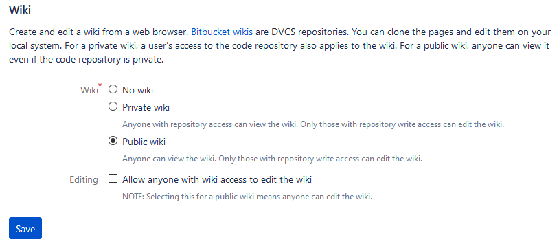
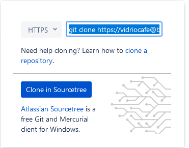
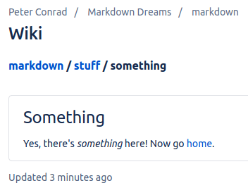

# Edit a Git wiki

<!--
TO DO

Add GH and Linux instructions
-->

A Git repository comes with a wiki, which makes it possible to collaboratively read and edit documentation. You can create a wiki to document projects or code stored in the repository, or you can just use a repository for its wiki capability.

!!! note
    A Git wiki is a second repository attached to your repository. You clone, pull, 
    and push t the repository and the wiki separately.
    
A Git wiki uses [Git wiki structure](../../tools/tools-publishing#git-wiki-structure) and it's one way to develop content for publishing in [MkDocs](../recipes-mkdocs/) or [Hugo](../recipes-hugo/)
     
## Ingredients

<table>
  <tr>
    <td><b><a href="../../tools/tools-editors/">Markdown editor</a></b></td>
  </tr>
  <tr>
    <td><b><a href="../../tools/tools-git-setup/">Git</a></b></td>
  </tr>
</table>
    
## Set up a wiki on your hosted repository

The steps are similar for different Git hosts and clients. Here is what those steps look like in Bitbucket and Sourcetree:

1. In a browser, log on to Bitbucket (or your preferred host).
1. Under "Repository settings" look for "Features" and click **Wiki**
1. Select **Public wiki** and save.  
   
   
## Edit content on the host 
   
If you just want to add a few pages to the wiki online, there's no more setup to do! Just go to your repository, click **Wiki**, and you'll see buttons for creating and editing pages. 

!!! hint
    To add a page in a new folder, make the folder part of the new filename. 
    For example: `morestuff/newpage.md` adds `newpage.md` in a folder called 
    `morestuff`.

## Clone the wiki to a local repository

There are advantages to cloning the wiki to a local repository:

- It's much easier to add folders and move files around
- You can work on it even when you're offlne
- You can use whatever Markdown editor you want

Here are the steps for Bitbucket:

1. Go to your online repository and click **Wiki**.
2. Click **Clone wiki** then **Clone in Sourcetree**.  
   

!!! note
    If you can't find **Clone in Sourcetree** (or, for GitHub, **Open in GitHub
    Desktop**) in your online repository:
    
    1. In your online repository, go to the wiki and look for the URL to
       clone the wiki repository locally.  
    1. In your client (Sourcetree or GitHub Desktop), click **File > Clone** 
       and paste the URL, then click **Clone**.

## Work with the content locally

On your computer, go to the directory where you cloned the wiki. There should be a directory called `wiki` containing a file called `Home.md`&mdash;the Markdown source for the welcome page the wiki displayed when you created it online.

You can now work with the wiki using either the [Git centralized workflow](../../tools/tools-git-basics#centralized-workflow) or the [GitHub flow](../../tools/tools-git-basics#github-flow)

## Tutorial

Why is this here? Just to show how to organize content and how it comes out

#### Try creating some content

Try making the following changes:

- Add a folder called `stuff`.
- Using your favorite Markdown editor, make a file called `something.md` inside `stuff`, with the following contents:  

    ```
    
    # Something

    Yes, there's *something* here! Now go [home](../Home).

    ```
    
You should now have a directory structure that looks like this:

```
Home.md
stuff/
    something.md

```


#### Take a look

After you commit and push the changes, take a look in your online wiki.

1. Go to your online repository and click **Wiki**.
2. View the page tree of the wiki. For example:
	- In Bitbucket, click the name of the wiki.
	- In GitHub, click **Pages**.
1. Navigate to the page you created.  
   
1. Try the `home` link.

## Next steps

Try the following recipe, which is very similar:

- [Collaborate using the Git centralized workflow](../recipes-centralized-workflow/) 