# Manage docs with GitHub Flow

Once your team or project reaches a certain size, branching is a good way to keep people from accidentally interfering with each other's work. It's also a great way to stage and test code or content before migrating to production. There are many branching strategies, some of them quite complicated. The one I like, and that I have used for documentation in the past, is called [GitHub Flow](https://scottchacon.com/2011/08/31/github-flow.html). It's simple but effective. Here's how it changes the single-branch **Pull-Work-Commit-Push** steps used in the [Centralized Git Workflow](../recipes/recipes-centralized-workflow/):

1. [**Pull**](../../getting-started-getting-started-git-basics/#pull) from master.
2. [**Create a new branch**](#) for working on this task.
3. From time to time, [**Stage and commit**](../../getting-started-getting-started-git-basics/#stave-and-commit) your changes.
4. When you want to make your work visible to others, [**Push**](../../getting-started-getting-started-git-basics/#push) to your working branch on the remote repository.
5. When your work is ready, [**Create a pull request**](#) and have your work reviewed.
6. Once your work is approved, [**Merge**](#) your branch into master on the remote.

After you're done with that part of the project, you can delete your working branch or keep it around for further work.

This looks like a lot more steps, but remember that you'll be spending most of your time working and committing, just as you would in the Centralized Git Workflow.


#### Create a new branch

=== "Sourcetree"
    
    1. asd

=== "GitHub Desktop"
     
    1. asd

=== "Linux command line"

    1. Pull from master to make sure you have the latestchanges.
    1. Create a new branch and switch to it with `git checkout -b`. Example:
        ```
        $ git checkout -b test-branch 
        Switched to a new branch 'test-branch'
        ```

#### Create a pull request

=== "Sourcetree"
    
    1. asd

=== "GitHub Desktop"
     
    1. asd

=== "Linux command line"

    1. asd
    
#### Merge

=== "Sourcetree"
    
    1. asd

=== "GitHub Desktop"
     
    1. asd

=== "Linux command line"

    1. asd
    


```
pconrad@tinybox:~/git/markdown/markdown-dreams/docs$ git pull
Already up to date.
pconrad@tinybox:~/git/markdown/markdown-dreams/docs$ git checkout -b test-branch 
Switched to a new branch 'test-branch'
pconrad@tinybox:~/git/markdown/markdown-dreams/docs$ touch new-file.md
pconrad@tinybox:~/git/markdown/markdown-dreams/docs$ git add new-file.md 
pconrad@tinybox:~/git/markdown/markdown-dreams/docs$ git commit -am "added new file"
[test-branch 851aa51] added new file
 1 file changed, 0 insertions(+), 0 deletions(-)
 create mode 100644 markdown-dreams/docs/new-file.md
pconrad@tinybox:~/git/markdown/markdown-dreams/docs$ ls
getting-started  img  index.md  index.md.backup  new-file.md  recipes  resources  tools

pconrad@tinybox:~/git/markdown/markdown-dreams/docs$ git checkout master 
Switched to branch 'master'
Your branch is up to date with 'origin/master'.
pconrad@tinybox:~/git/markdown/markdown-dreams/docs$ ls
getting-started  img  index.md  index.md.backup  recipes  resources  tools
pconrad@tinybox:~/git/markdown/markdown-dreams/docs$ git checkout test-branch 
Switched to branch 'test-branch'
pconrad@tinybox:~/git/markdown/markdown-dreams/docs$ ls
getting-started  img  index.md  index.md.backup  new-file.md  recipes  resources  tools

pconrad@tinybox:~/git/markdown/markdown-dreams/docs$ git push origin test-branch 
Enumerating objects: 14, done.
Counting objects: 100% (14/14), done.
Delta compression using up to 4 threads
Compressing objects: 100% (10/10), done.
Writing objects: 100% (10/10), 4.39 KiB | 1.10 MiB/s, done.
Total 10 (delta 2), reused 0 (delta 0)
remote: Resolving deltas: 100% (2/2), completed with 1 local object.
remote: 
remote: Create a pull request for 'test-branch' on GitHub by visiting:
remote:      https://github.com/pconrad-fb/markdown/pull/new/test-branch
remote: 
To https://github.com/pconrad-fb/markdown.git
 * [new branch]      test-branch -> test-branch
pconrad@tinybox:~/git/markdown/markdown-dreams/docs$ 

```


## Pull

Make sure you're on `master`

## Create a branch (and publish it, in GHD?)

Sourcetree:

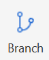

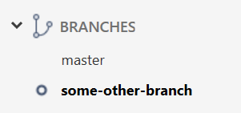

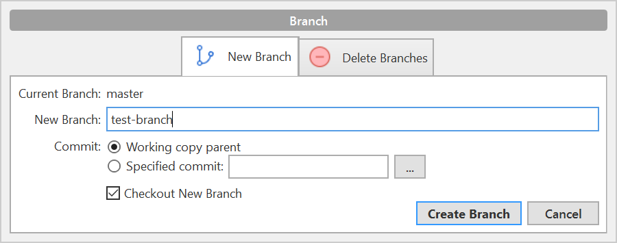

GH/GHD:

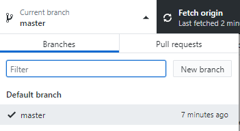

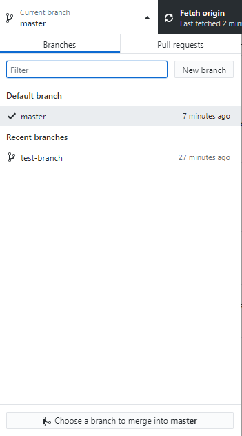

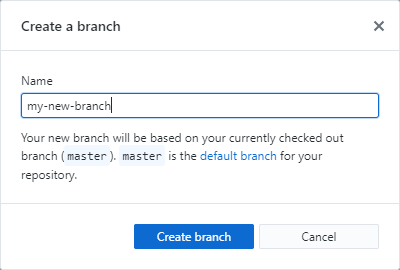

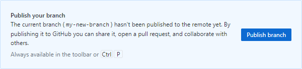

## Work and commit

as usual - but you're on whateve branch

## Push and do a PR

Sourcetree/BB: **Repository > Create pull request** or use the commit options on your last commit  
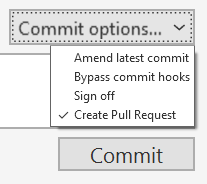

Then it gives you this dialog:

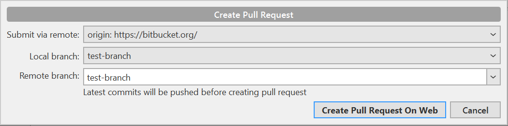

Then you create a PR online:

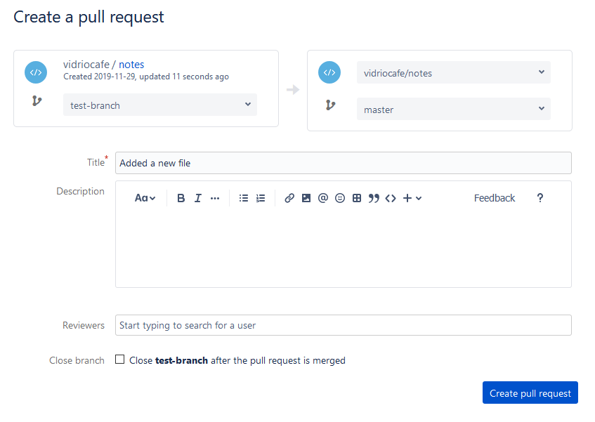

Add reviewers, etc. 


and then you get a PR. Here's some of the secreen for reference


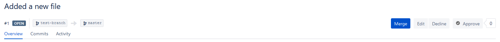

GH/GHD:

You push:

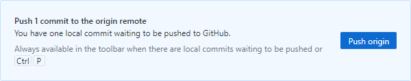

Then you create a PR

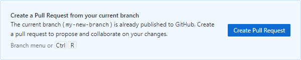


and it takes you to create a PR online in GitHub:
 
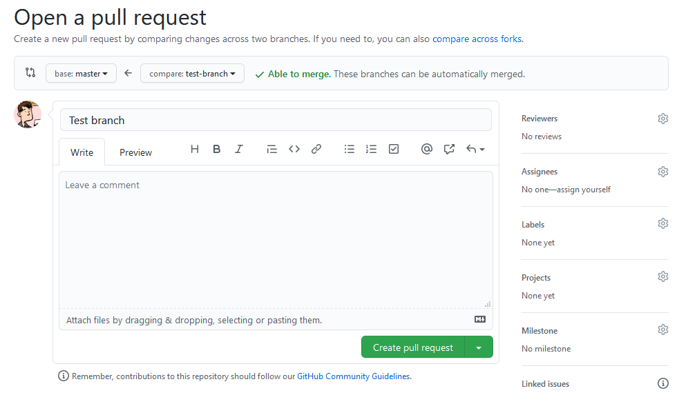

  
  
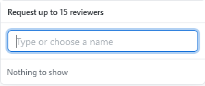


Approve (if reviewers) and merge

BB:


 
GH: 
Scroll down to see the Merge button
  
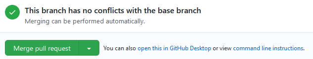

## Close branch, go back to master!