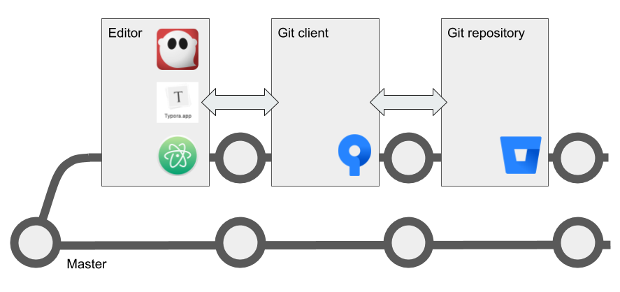

# Manage docs with GitHub Flow

Once your team or project reaches a certain size, branching is a good way to keep people from accidentally interfering with each other's work. It's also a great way to stage and test code or content before migrating to production. There are many branching strategies, some of them quite complicated. The one I like, and that I have used for documentation in the past, is called [GitHub Flow](https://scottchacon.com/2011/08/31/github-flow.html). It's simple but effective. Here's how it changes the single-branch **Pull-Work-Commit-Push** steps used in the [Centralized Git Workflow](../recipes/recipes-centralized-workflow/).

## What you need

<table>
  <tr>
    <td><b><a href="../../tools/tools-editors/">Markdown editor</a></b></td>
  </tr>
  <tr>
    <td><b><a href="../../tools/tools-git-setup/">Git</a></b></td>
  </tr>
  <tr>
    <td><b><a href="../../tools/tools-publishing/">Publishing tools</a></b></td>
  </tr>
</table>

!!! hint
    Plan ahead based on the publishing tool you want to use. 
    If you're planning to use a wiki, MkDocs, or  Hugo, organize your docs in 
    [Git wiki structure](../../tools/tools-publishing#git-wiki-structure)
    from the start. If you're creating documents with Pandoc, think about
    whether you need to work on content in pieces and then use Pandoc to assemble
    everything.

## Working with content

This uses the GitHub Flow.

--8<-- "github-flow-snippet.html"

!!! hint
    After you're done with that part of the project, you can delete your working branch
    or keep it around for further work. Before starting work on a different part of the
    project, remember to switch to `master` and pull again.
    
There's nothing more to it than

1. [Pick an editor](../../tools/tools-editors/)
2. [GitHub flow](../../tools/tools-git-basics/#github-flow)
3. [Publish content](../../tools/tools-publishing/)

So, you have your local git repo where ou store MD files
REmember not to publish there! Publish to the web or a synced folder but not to the repo
   
   
The publishing tool is like MkDocs for docs, Hugo for a website, etc. Go see those recipes

## Next steps

Check out the following recipes  :

- [Manage docs with Gitflow](../recipes-gitflow/)
- [Create an eBook](../recipes-pandoc-ebook/)
- [Write a Word doc](../recipes-pandoc-word/)
- [Publish a PDF](../recipes-pandoc-pdf/)
- [Present slides](../recipes-slides/)