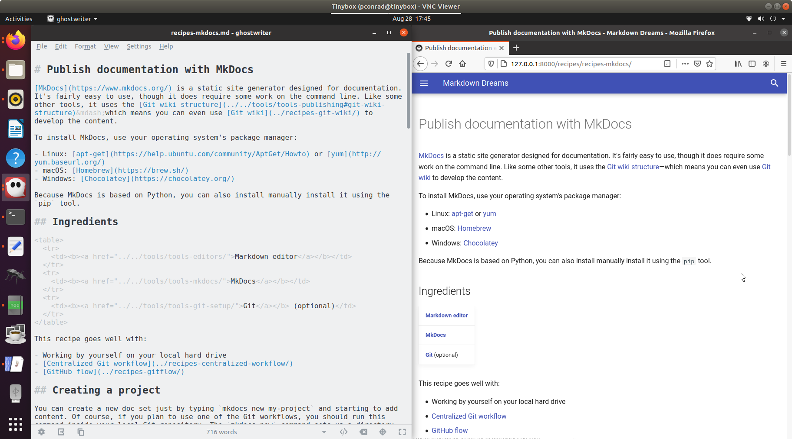

# Publish documentation with MkDocs

[MkDocs](https://www.mkdocs.org/) is a static site generator designed for documentation. It's fairly easy to use, though it does require some comfort with the command line. Like some other tools, it uses the [Git wiki structure](../../tools/tools-publishing#git-wiki-structure)&mdash;which means you can even use [Git wiki](../recipes-git-wiki/) to develop the content.

To install MkDocs, use your operating system's package manager:

- Linux: [apt-get](https://help.ubuntu.com/community/AptGet/Howto) or [yum](http://yum.baseurl.org/)
- macOS: [Homebrew](https://brew.sh/)
- Windows: [Chocolatey](https://chocolatey.org/)

Because MkDocs is based on Python, you can also install it using the `pip` tool.

## Ingredients

<table>
  <tr>
    <td><b><a href="../../tools/tools-editors/">Markdown editor</a></b></td>
  </tr>
  <tr>
    <td><b><a href="../../tools/tools-mkdocs/">MkDocs</a></b></td>
  </tr>
  <tr>
    <td><b><a href="../../tools/tools-git-setup/">Git</a></b> (optional)</td>
  </tr>
</table>

This recipe goes well with:

- [Centralized Git workflow](../recipes-centralized-workflow/)
- [GitHub flow](../recipes-gitflow/)

## Creating a project

You can create a new doc set just by typing `mkdocs new my-project` and starting to add content. Of course, if you plan to use one of the Git workflows, you should run this command inside your local Git repository. The `mkdocs new` command sets up a directory that contains two things:

- A directory called `docs` containing `index.md`
- A file called `mkdocs.yml` that you use for configuring your project.

As you might have guessed, `index.md` is a congratulatory default first page, and you can change it, add directories and files, and start building the site in the `docs` directory.

## Live preview

The command `mkdocs serve` starts a webserver that lets you preview your content as you create it. 

!!! note
    You must run `mkdocs serve` in the directory that contains the `mkdocs.yml` file.

Whenever you save a Markdown file, MkDocs does its best to update the preview. Sometimes if you change the site navigation, it can't keep up. When that happens, just use Control-C to stop the server and then type the command again to start it.



When the webserver starts, it provides information about any broken links in your content, any files that are unused, and where to point your browser to see the content. Here's an abbreviated version of some output I got while working on these recipes:

```
$ mkdocs serve
INFO    -  Building documentation... 
INFO    -  Cleaning site directory 
INFO    -  The following pages exist in the docs directory, but are not included in the "nav" configuration:
  - getting-started/index.md
  - recipes/index.md
WARNING -  Documentation file 'recipes/recipes-centralized-workflow.md' contains a link to 'recipes-slides.md' which is not found in the documentation files. 
INFO    -  Documentation built in 1.82 seconds 
[I 200728 20:45:18 server:296] Serving on http://127.0.0.1:8000
INFO    -  Serving on http://127.0.0.1:8000
[I 200728 20:45:18 handlers:62] Start watching changes
INFO    -  Start watching changes
[I 200728 20:45:18 handlers:135] Browser Connected: http://127.0.0.1:8000/recipes/recipes-centralized-workflow/
INFO    -  Browser Connected: http://127.0.0.1:8000/recipes/recipes-centralized-workflow/
```


## Adding a theme

The default look is fine, but you'll probably want to choose a [theme](https://github.com/mkdocs/mkdocs/wiki/MkDocs-Themes). Themes don't just change the look of the site&mdash;they sometimes add extensions and capabilities (such as the [Python Markdown Extensions](https://python-markdown.github.io/extensions/)).

You can add a theme, activate extensions, and set up site navigation in the site configuration file `mkdocs.yml`:

- To add a theme, you download a bunch of files (sometimes by cloning a Git repo) and copy them into your MkDocs project directory, then add the theme name to the `theme` parameter
- To use the theme's extensions, you list them in the `markdown_extensions` parameter
- To set up site navigation, list titles and filenames hierarchically in the `nav` parameter

Here's an abbreviated version of my `mkdocs.yml` file:

```

site_name: Markdown Dreams

theme:
  name: material

markdown_extensions:
  - admonition
  - pymdownx.highlight:
      use_pygments: true
  - pymdownx.snippets
        base_path: 'snippets/'

nav:
    - 'How to do things with Markdown': 'index.md'
    - 'Getting started': 'getting-started/index.md'
    - 'Tools':
        - 'Markdown editors': 'tools/tools-editors.md'
        - 'Source control': 'tools/tools-git.md'
        - 'Publishing': 'tools/tools-publishing.md'
    - 'Recipes':
        - 'Overview': 'recipes/index.md'
        - 'Run a Git wiki': 'recipes/recipes-git-wiki.md'
    - 'Resources': 'resources/index.md'
```

To save length, I stripped out a lot of the navigation, but you get the idea.

!!! hint
    You don't have to set up navigation manually. If you don't, MkDocs provides
    fairly sensible navigation automatically. But the option is there if you 
    need that level of control.

## Working with content

For the most part, working with content is just as you would expect: Markdown in Git wiki structure, using the workflow of your choice. Here are a few tips:

- Links take some getting used to. Each link is relative based on the location of the
  page in which the link appears. Each file is treated as a folder by the
  browser. To link to the "Source control" page from "Run a Git wiki" in the above
  navigational structure, you would add the following link:   
  `[Source control](../../tools/tools-git.md)` 
- Because all HTML is valid Markdown, you can use HTML. However, you can't use
  Markdown inside a block of HTML.
- If you choose a theme that includes features like snippets and admonitions, then
  you can do things outside the bounds of normal Markdown. This is very useful, but
  makes it harder to use your Markdown source files with other tools
  (unless you take the fun stuff out).
  
!!! hint
    If you have trouble with a link, look at the output of `mkdocs serve`.

### Snippets

If you use snippets, the location of the included files is relative to the top-level directory of your project (`my-project` for example). It's a good idea to create a directory for snippets and then define it in the `base_path` variable in your `mkdocs.yml` file. 

I created a directory called `snippets` and defined it as shown in the `mkdocs.yaml` sample above. That way, I can include snippets using only the filename and I don't have to think about a relative path from the page where I am using the snipppet:

<pre>&#45;-8<-- "github-flow-snippet.html"</pre>

!!! hint
    Adding or changing a snippet sometimes requires restarting the webserver before
    the changes show up in the live preview.

## Building and publishing

The `mkdocs build` command builds the website in a directory called `site`. 

!!! note
    You must run `mkdocs build` in the directory that contains the `mkdocs.yml` file.

To publish the site, use FTP to transfer the contents of that directory to a folder on a webserver.

!!! hint
    To prevent Git from tracking changes to the `site` directory, create a file called
    `.gitignore` at the top level directory of the MkDocs project with the following
    contents:
    
    ```
    site/
    ```

    If you use `git add` to add your `.gitignore` file to change tracking, then
    it will apply to anyone who clones the repo&mdash;meaning that no one will 
    add built HTML pages to Git.