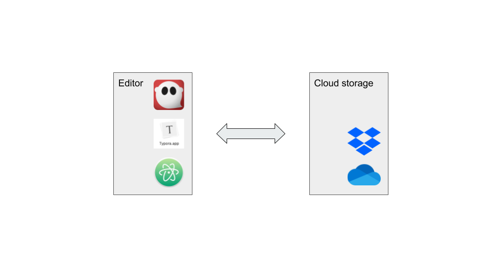
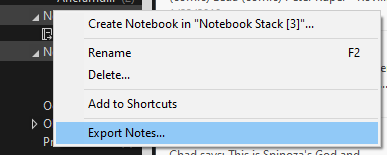
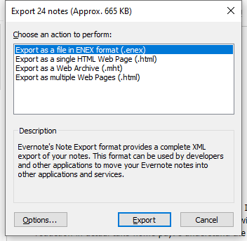
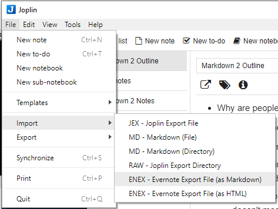
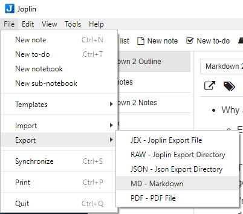
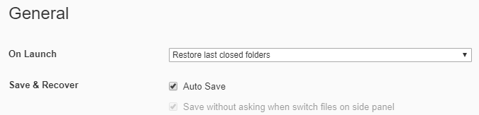
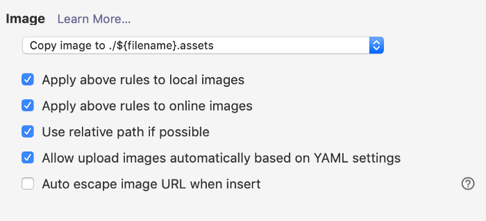
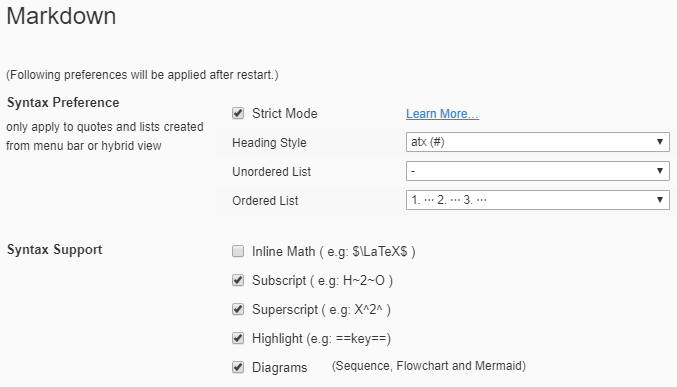

# Take notes

Markdown is a great tool for taking notes quickly, because you can accomplish all the basic formatting without taking your hands off the keyboard. You can use any Markdown editor to work with files on your computer, but you can also share notes across your devices using a cloud storage service such as Dropbox plus a note-taking app like Joplin or a Markdown editor like Typora.

This recipe describes two way to take notes:

- Using Joplin
- Using Typora

## Ingredients

<table>
  <tr>
    <td><b><a href="../../tools/tools-editors/">Markdown editor</a></b></td>
  </tr>
  <tr>
    <td><b><a href="../../tools/tools-storage/#cloud-storage">Cloud storage</a></b></td>
  </tr>
</table>

## Joplin

[Joplin](https://joplinapp.org/) is designed specifically for taking notes, and shares some features with applications like Evernote. You can store your notes as local files on your computer, or sync them to the cloud with a service like Dropbox or OneDrive. You can even encrypt your notes end-to-end for privacy.

Setting up Joplin is fairly straightforward. In the **Preferences** screen, there is a place to choose your storage: local filesystem, DropBox, and so on. If you want to sync Joplin across devices, configure all your Joplin instances to use the same cloud storage location.

### Getting your old notes from Evernote 

One of the great features of Joplin is that you can import notes from Evernote. The caveat is that the imported Markdown files will not have sensible filenames&mdash;but this is still better than manually copying and pasting each note individually.

To export each notebook from Evernote:

1. Right click a notebook in the left nav and select Export notes  
     
2. Export the notebook as an ENEX file.  
     
3. In Joplin, go to File > Import and import the notebook as Markdown.  
     
4. You can then export the notebook as Markdown from Joplin into the folder where you have decided to store your notes.  
   
   
## Typora

As an alternative to Joplin, you can use another editor such as Typora. Both Joplin and Typora provide a navigation tree to make it easy to organize and manage "notes" (which are just Markdown files). The advantage of Joplin is that it is a dedicated note-taking app. The advantage of Typora is that it is a Markdown editor, which means you get a lot more tools for integrating into a content management and publishing toolchain. If you plan to do more than note-taking, consider installing a Markdown editor such as Typora or Ghostwriter. Actually, there's nothing stopping you from using all three!

Installing and using Typora is pretty straightforward. You can store files in multiple folders, which makes it easy to set up a note-taking folder, a drafts folder, a documents folder, and so on. Any of these folders could by synced by Dropbox or another service.

!!! hint
    You can use Joplin to get your old notes from Evernote, then use Typora to manage 
    and edit them.

### Setting up Typora to take notes

To fine-tune Typora as a note-taking application, set a few preferences:

1. Go to **File > Preferences**. 
1. Click the **General** tab:  
1. For On Launch, select **Restore last closed folders**. When you set up a folder to
   contain your notes, Typora will open it for you automatically. Of course, you can
   also open other files and folders.
1. Check the **Auto Save** checkbox and make sure **Save without asking…** is checked.
   You won’t have to think about saving notes; they’ll just always be saved.
   

1. Click the **Image** tab.
1. Select **Copy image to ./${filename}.assets**. Typora will make a folder for each    
   document’s images. This makes it easy to take the images along if you convert the
   document to a different format or send it to another location.
1. Check all the boxes except for the auto escape one. This makes sure that local files
   and online images also get added to the .assets folder. By the way, Typora saves
   copies of pasted images, too!
   

1. Click the **Markdown** tab.
1. Check the **Highlight** box so that you can highlight things in your notes.
   

