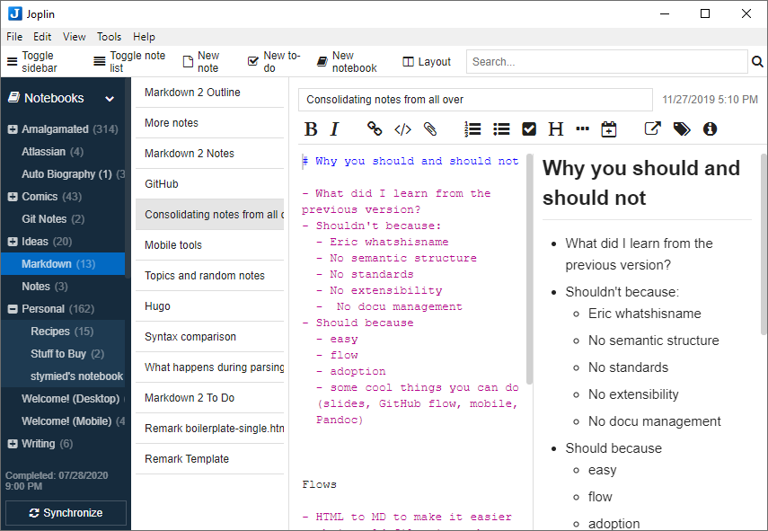
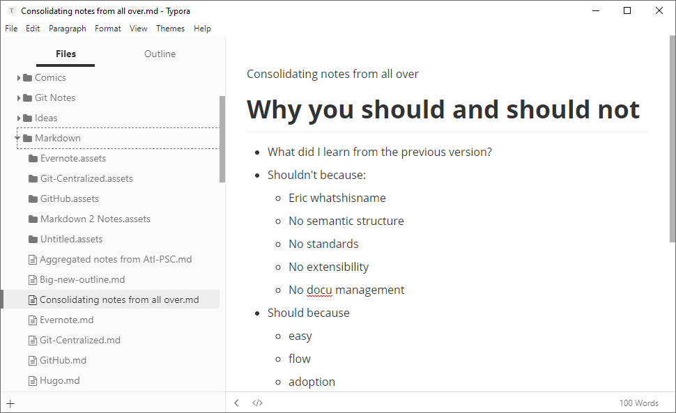

# Take notes

<!--
TO DO

- Add mobile Joplin screenshot
- Add iA Writer screenshots
- Any other note apps?
  - https://notable.app/#features - like iA
-->

## Ingredients

<table>
  <tr>
    <td><b><a href="../../tools/tools-editors/">Markdown editor</a></b></td>
  </tr>
  <tr>
    <td><b><a href="../../tools/tools-storage/#cloud-storage">Cloud storage</a></b></td>
  </tr>
</table>

Either Joplin or another editor
Either local disk or synced folder/backend

Talk about how to set up Joplin with backend, how it works with external editing, how to do encryption.

Alternative: just point Typora at a Dropbox or other synced folder. You can collaborate with people this way!

## Joplin

Getting your old notes from Evernote

If you need to get your old notes from Evernote, you can use Joplin to grab them — with the caveat that the Markdown files will have non-human-readable names. It’s still better than manually copying and pasting each one individually.

You can export notebook by notebook from Evernote:

1. Right click a notebook in the left nav and select Export notes  
     
2. Export the notebook as an ENEX file.  
     
3. In Joplin, go to File > Import and import the notebook as Markdown.  
     
4. You can then export the notebook as Markdown from Joplin into the folder where you have decided to store your notes.  
   
   
## Typora

Installing and using Typora is pretty straightforward. Just use a folder in Dropbox or your preferred cloud storage provider to sync your documents across devices.

To fine-tune Typora as a note-taking application, you will want to set a few preferences.

Go to File > Preferences. On the General tab:

    For On Launch, select Restore last closed folders. When you set up a folder to contain your notes, Typora will open it for you automatically. Of course, you can also open other files and folders.
    Check the Auto Save checkbox and make sure Save without asking… is checked. You won’t have to think about saving notes; they’ll just always be saved.

On the Image tab:

    Select Copy image to ./${filename}.assets. Typora will make a folder for each document’s images. This makes it easy to take the images along if you convert the document to a different format or send it to another location.
    Check all the boxes except for the auto escape one. This makes sure that local files and online images also get added to the .assets folder. By the way, Typora saves copies of pasted images, too!

On the Markdown tab:

    It’s very useful to check the Highlight box so that you can highlight things in your notes.
    There are other interesting syntax features to explore, including diagrams.

## Joplin and Typora

If you want something that feels more like Evernote, go for Joplin. If you want something that is designed for creating content and also works for taking notes, use Typora. Joplin also works on mobile! If you use Typora on computer, I recommend iA Writer on movile

## iA Writer

