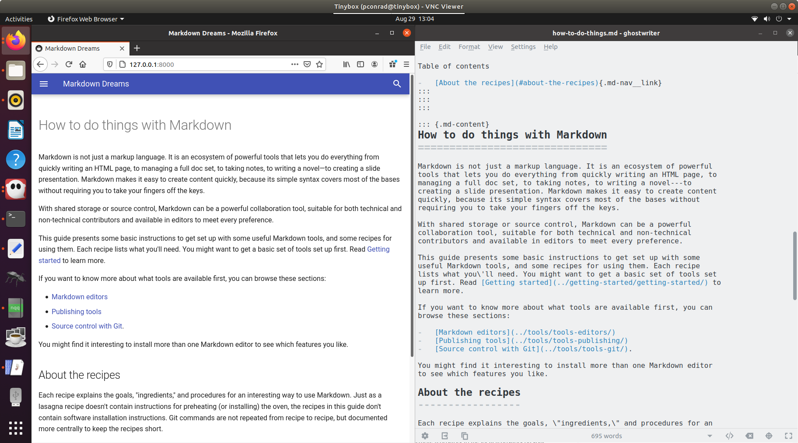

# Grab a web page with Pandoc

Converting a web page to Markdown on the fly is a small task that can be very helpful if you need to grab content for editing or add information from the web to your notes.

## Ingredients

<table>
  <tr>
    <td><b><a href="../../tools/tools-editors/">Markdown editor</a></b></td>
  </tr>
  <tr>
    <td><b><a href="../../tools/tools-pandoc/">Pandoc</a></b></td>
  </tr>
</table>

## Syntax

The command is very simple:

```
pandoc -s -r html http://127.0.0.1:8000/ -o how-to-do-things.md
```


## Result

The result is a Markdown file converted from the web page You probably can't use the resulting Markdown as-is, because most modern web pages include a lot of code in addition to the human-readable content. However, you can see that the content is easy to read and convenient to copy and paste to another Markdown file. Pandoc tries its best to convert the `<div>` tags and their attributes to its own fenced div notation, which makes even the extra junk more readable as well.

