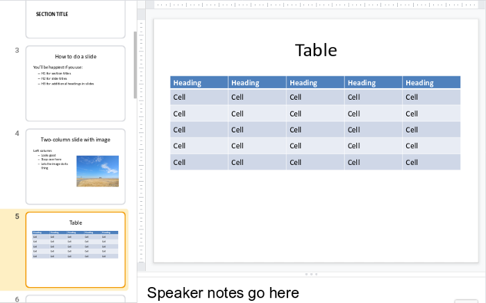
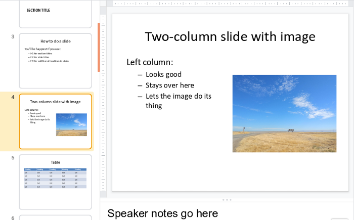

# Overview

## Ingredients

<table>
  <tr>
    <td><b><a href="../../tools/tools-editors/">Markdown editor</a></b></td>
  </tr>
  <tr>
    <td><b><a href="../../tools/tools-pandoc/">Pandoc</a></b></td>
  </tr>
</table>


- Overall, how it works, concatenation, div stuff, whatever we can use for all of them
- Image scaling, all that

Then, Sections for

- Slides - you'll be making PPT so you need PPT or Drive. For standalone see that recipe
- Word
- PDF
- eBook
- What else?

More Pandoc Tricks: Divs and Attributes


## Hard ones


	- Documentation with GitFlow
	- Collaborate with Distributed
	- Just taking notes - Joplin or Typora/Dropbox
	- Git Wiki
	- Slides
	- Word docs
	- eBook
	- PDF
	
	
## Powerpoint

With Pandoc, you can go from Markdown directly to Powerpoint. This method offers a great deal of formatting flexibility. Columns, tables, sub-bullets, and images come out just the way you would expect them to look. I had no trouble opening a Pandoc-rendered .pptx file in Powerpoint or importing it into Google Slides.



Here is some sample Markdown:

```
# Section Title

## Slide TitleText on a slide:

* Bullet
* Bullet
* Bullet

::: notes
Speaker notes go here
:::
```

For Powerpoint slides, Pandoc doesn’t require the hyphen separator. The above Markdown contains two slides: one with an H1 as a section title and another that uses an H2 for the slide title. Notice the ::: — Pandoc’s fenced div syntax, which lets you do a lot of tricks in various formats. Here, it is just used to delineate the speaker notes.

The Pandoc command to build a .pptx file is simple:

pandoc myslides.md -o myslides.pptx

As you would expect, you don’t need the -s flag (because what is the alternative to a standalone Powerpoint presentation?) and you can open the resulting .pptx file in Powerpoint. But there’s one more piece of magic:

pandoc myslides.md -o myslides.pptx --reference-doc another.pptx

When you run the command with the --reference-doc parameter, Pandoc takes the theme from the specified existing Powerpoint file and applies it to the new one you are creating.

That means if you have a theme you like, you can create a whole presentation in that theme — no one will know you started with Markdown. This feature doesn’t always work with heavily modified presentations or corporate templates, but I was able to get it to work with built-in templates and one template that I had customized.

That fenced div notation lets you create columns using nested divs without writing <div> tags in HTML. Take a look at this example:

:::::::::::::: {.columns}
::: {.column width="50%"}

Left column:

- Bullet
- Bullet
- Bullet

:::
::: {.column width="50%"}


:::
::::::::::::::

That translates to a <div class="columns"> containing two <div class="column"> tags that Pandoc can understand. It uses these to create a slide with columns. Notice that the opening and closing of the outer div has a whole bunch of : characters instead of just three. This is for readability; you can use as few as three if you like.




The curly braces let you define attributes such as identifiers, classes, and key/value pairs on headers, images, and a few other elements in Pandoc. If you’re using Pandoc to create Word or other long text documents, this is handy because you can set anchors on headings and link to them internally.

Above, we are just using the attributes to add the column and columns classes to the fenced divs to create columns. But there is another cool attributes trick from Pandoc that we can use — scaling an image:

{width=25%}

When Pandoc renders the image, it is scaled to a percentage of the container where it resides (a slide or column, for example). The alt text is used for a caption.