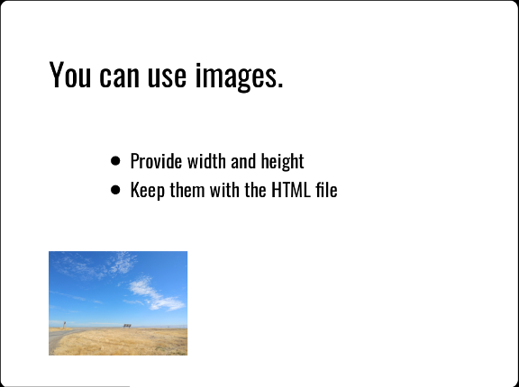

# Create a DZSlides presentation

You can use Pandoc to create a standalone slide presentation in DZSlides format, which is useful for presenting when you aren't sure what software will be available. DZSlides creates bold, attractive slides that discourage the use of too much text.

## Ingredients

<table>
  <tr>
    <td><b><a href="../../tools/tools-editors/">Markdown editor</a></b></td>
  </tr>
  <tr>
    <td><b><a href="../../tools/tools-publishing/#pandoc">Pandoc</a></b></td>
  </tr>
    <tr>
    <td>A browser</td>
  </tr>
</table>


## Markdown for DZSlides

Start your Markdown file with YAML metadata or a simple block like this:

```
% Title
% Author Name
% Date
```

DZSlides uses the horizontal rule (`---`) as a separator between slides. A level one or level two heading is a section title.

Here'’s some sample Markdown:

```
---

# H1 or H2 is a Section Title

---

Normal Text or Slide Title

- Bullet
- Bullet

---
```

Normal text is big enough for a title or announcement on a slide.


The layout of slides in DZslides is simple; you probably won'’t find yourself
using tables or columns a lot.

### Images

When your Markdown includes images, use relative paths. For example:

```

```

In the above example, the `images` directory is at the same level as the file containing the Markdown file; the relative path goes up a directory from the Markdown file and then down into the `images` directory to find the image.

When Pandoc follows these relative links, it starts from the directory where you typed the `pandoc` command. If you want Pandoc to find your images, either run the command from a directory where the relative links to the images make sense, or copy the images to a place where the relative links can find them.

After you create the presentation, which is an HTML file, you need to keep the images and the presentation together. If you copy your presentation to a thumb drive without the images, the images won't work. 

!!! hint
    It'’s a good idea to create the Markdown presentation in a folder with all the images
    it needs, then use Pandoc to build the presentation in the same folder. You can copy
    the entire folder wherever you need it, knowing that all the images for the
    presentation will work.

Pandoc provides syntax for scaling an image:

```
{width=25%}
```



When Pandoc renders the image, it is scaled to a percentage of the container where it resides (the slide, in most cases). The alt text is used for a caption.

## Creating the presentation

The command for creating the document is simple. With a single Markdown file, it looks like this:

```
pandoc -t dzslides -s myslides.md -o myslides.htm

```

The `-s` option tells Pandoc to create a standalone presentation, including all the CSS, HTML, and JavaScript needed to display it. You can view the presentation by opening the resulting HTML file in a browser.


## Next steps

- Check out the [DZSlides template](../../resources/templates/#dzslides)