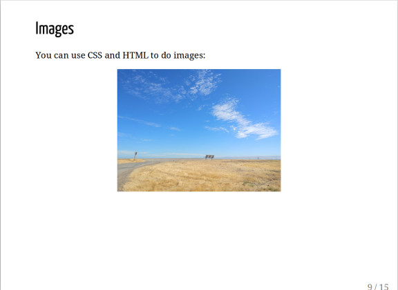

# Create a Remark presentation

Remark is a standalone slide presentation tool that you edit directly and view in a browser. You create slides in your favorite Markdown editor, then paste them into a specific place in the HTML file. 

There are three ways to use Remark:

- [`boilerplate-single.html`](https://github.com/gnab/remark/blob/develop/boilerplate-single.html) &ndash; a standalone presentation containing the entire JavaScript code
- [`boilerplate-local.html`](https://github.com/gnab/remark/blob/develop/boilerplate-local.html) &ndash; a standalone presentation that references the JavaScript code from a local file
- [`boilerplate-remote.html`](https://github.com/gnab/remark/blob/develop/boilerplate-remote.html) &ndash; a presentation that references the JavaScript code online

!!! hint
     If you're not sure which version to choose, start with `boilerplate-remote.html`
     because it is easy to edit and doesn't require you to download the JavaScript file
     separately.


## Ingredients

<table>
  <tr>
    <td><b><a href="../../tools/tools-editors/">Markdown editor</a></b></td>
  </tr>
  <tr>
    <td><b><a href="../../tools/tools-publishing/#remark">Remark.js</a></b></td>
  </tr>
  </tr>
    <tr>
    <td>A browser</td>
  </tr>
</table>

## Markdown for Remark

Remark uses level one or level two headings for slide titles and separates slides with the horizontal rule (`---`). Speaker notes are at the end of each slide, marked by three question marks (`???`).

Here is some example Markdown:

```
class: center, middle

# Remark template
.right[Author]
.right[Date]

---

# Slide title

Normal text:

* Bullet
* Bullet
* Bullet

???
Speaker notes go here

---

```

Remark provides some rudimentary CSS to style slides. The above example uses `class: center, middle` to put the slide title in the middle of the slide, and `.right` to align the text showing the author and date. 

You can use normal Markdown image syntax, but you can also use CSS and HTML to change the way images appear:

```
.center[</img>]
```



More complicated CSS is available if you want to experiment further, but is beyond the scope of this recipe.

## Creating the presentation

Remark needs three things to work: boilerplate HTML, the `remark.js` script, and your Markdown.

1. Open [`boilerplate-remote.html`](https://github.com/gnab/remark/blob/develop/boilerplate-remote.html) in a text editor.
1. Add your Markdown in the source text area. Example:
   ```
    <textarea id="source">

    class: center, middle

    # Title

    ---

    # Agenda

    1. Introduction
    2. Deep-dive
    3. ...

    ---

    # Introduction

    </textarea>
   ```
1. Save the file with a new name (`my-slides.html`, for example) and open it in a browser.

Any changes you save from the text editor show up in the browser when you reload. Like other browser-based slide tools, remember that you need to keep your images where the HTML expects to find them.

!!! hint
    It'’s a good idea to create the Markdown in a folder together with the 
    boilerplate HTML, any images, and `remark.js` (if needed). That way, you can copy
    the entire folder wherever you need it, knowing that the presentation will work.


## Next steps

- Check out the [Remark template](../../resources/templates/#remark)