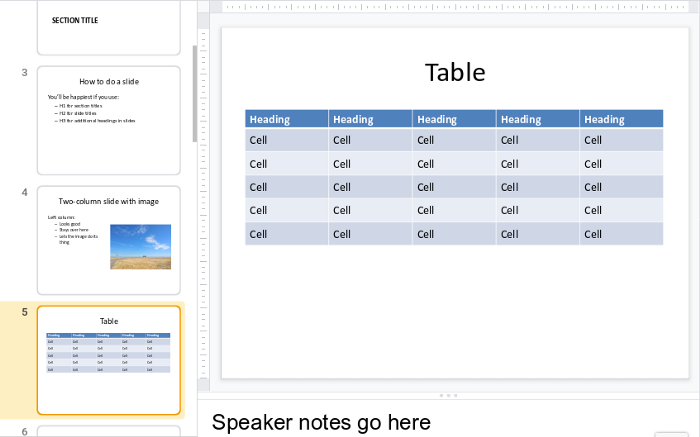

# Create a PowerPoint presentation

You can use Pandoc to create a presentation for display and editing in PowerPoint, for upload to Google Drive, or for use with other publishing tools.

## Ingredients

<table>
  <tr>
    <td><b><a href="../../tools/tools-editors/">Markdown editor</a></b></td>
  </tr>
  <tr>
    <td><b><a href="../../tools/tools-pandoc/">Pandoc</a></b></td>
  </tr>
   <tr>
    <td><b>PowerPoint, Google Drive, or LibreOffice</b></td>
  </tr>
</table>

## Markdown for PowerPoint slides

Start your Markdown file with YAML metadata or a simple block like this:

```
% Title
% Author Name
% Date
```

Pandoc uses a complicated rule to figure out what header level to use for slide titles, but it boils down to this:

- Use heading level one (`#`) for a section title
- Use heading level two (`##`) for a slide title

For example:

```
# Section Title

## Slide Title

Text on a slide:

* Bullet
* Bullet
* Bullet

::: notes
Speaker notes go here
:::
```

The above Markdown contains two slides: 

- A section title slide 
- A slide with a level two heading for the title

Notice the `:::` character&mdash;this is Pandoc’s fenced div syntax, which lets you do a lot of tricks in various formats. Here, it is just used to delineate the speaker notes.



### Special Pandoc formatting

Pandoc includes a number of formatting tricks that you might find useful. One of the most useful is fenced div syntax, which uses groups of colons as shorthand for `<div>` tags. 

Take a look at this example:

```
:::::::::::::: {.columns}
::: {.column width="50%"}

Left column:

- Bullet
- Bullet
- Bullet

:::
::: {.column width="50%"}


:::
::::::::::::::

```

That translates to a `<div class="columns">` tag containing two `<div class="column">` tags. Pandoc uses these to create two columns in a PowerPoint slide. Each div can be signified with as few as three colons in a row. In the example, the outer div uses more colons for readability.

The curly braces let you define *attributes* such as identifiers, classes, and key/value pairs on headers, images, and a few other elements in Pandoc. In the above example, the attributes specify the names and widths of the divs.

### Images

When your Markdown includes images, use relative paths. For example:

```

```

In the above example, the `images` directory is at the same level as the file containing the Markdown file; the relative path goes up a directory from the Markdown file and then down into the `images` directory to find the image.

When Pandoc follows these relative links, it starts from the directory where you typed the `pandoc` command. If you want Pandoc to find your images, either run the command from a directory where the relative links to the images make sense, or copy the images to a place where the relative links can find them.

You can use an attribute to scale an image:

```
{width=25%}
```

When Pandoc renders the image, it is scaled to a percentage of the container where it resides (a column, for example). The alt text is used for a caption.

## Creating the presentation

The command for creating the document is simple. With a single Markdown file, it looks like this:

```
pandoc -o my_slides.pptx my_slides.md
```

### Using a reference document

You can apply the theme and styles from another PowerPoint document called a *reference document.* For example:

```
pandoc --reference-doc another.pptx -o my_slides.pptx my_slides.md
``` 

This gives your converted PowerPoint document the same look and feel as the other presentation.

## Next steps

- Check out the [PowerPoint template](../../resources/templates/#powerpoint)