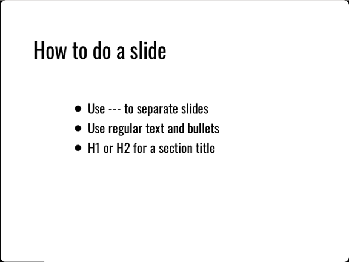

# Create a standalone presentation


## Ingredients

<table>
  <tr>
    <td><b><a href="../../tools/tools-editors/">Markdown editor</a></b></td>
  </tr>
  <tr>
    <td><b><a href="../../tools/tools-slides/">Markdown presentation tool</a></b></td>
  </tr>
</table>


## DZslides

If you want to do one of those slick presentations with big images and very few words, DZslides is an easy way to do it.

Here’s some sample Markdown:

```
---

# H1 or H2 is a Section Title

---

Normal Text for Slide Title

- Bullet
- Bullet

---
```

DZslides uses an H1 or H2 as a section header, which you will probably mostly have on a slide by itself. Normal text is big enough for a title or announcement on a slide.



The layout of slides in DZslides is bold and simple; you probably won’t find yourself using tables or columns a lot.

Once you have created your slides in Markdown, build them with Pandoc:

pandoc -t dzslides -s myslides.md -o myslides.htm

The -s option tells Pandoc to create a standalone presentation, including all the CSS, HTML, and JavaScript needed to display it. You can view the resulting HTML file in a browser.


Remember, since it’s HTML, you need to keep the images and the presentation together. If you copy your presentation to a thumb drive without the images, you will be unhappy. It’s a good idea to create the Markdown presentation in a folder with all the images it needs, make sure it works in your favorite Markdown editor’s preview mode, then use Pandoc to build the presentation in the same folder. You can copy the folder wherever you need it, knowing that all the images are there.

## Remark

If you don’t want to use Pandoc, consider Remark: a standalone slide presentation that you edit directly. Because it uses Markdown nestled inside an HTML document, your favorite Markdown editor might get confused. Mine did. This makes it a little less convenient to edit.

On the other hand, you don’t need Pandoc — so you don’t need a computer — so if you are stuck in an airport with nothing but your phone, Remark might just be your smartest choice.

The Markdown is a little different, but shouldn’t look unfamiliar by now:

```
class: center, middle

# Remark template
.right[Author]
.right[Date]

---

# Slide title

Normal text:

* Bullet
* Bullet
* Bullet

???
Speaker notes go here

---

```

Remark provides some rudimentary CSS to style slides. The first slide uses an H1 header as a section header. The simplified CSS code class: center, middle puts it in the middle of the slide. I added smaller text for the author and date, using .right to right-align it. You can use.right, .left, and .center to align text in different positions on the slide. This does not mean you can easily create columns in Remark. You can do it, but it requires authoring more complicated CSS.

You can use H1 or H2 for slide titles — I prefer H1. Speaker notes are set off with ??? and the usual --- separator denotes slide boundaries.


You don’t have to build a Remark presentation; it just is. You can open it in a text editor and a browser. Any changes you save from the text editor show up in the browser when you reload. Like other browser-based slide tools, remember that you need to keep your images where the HTML expects to find them.

There is one important choice to make with Remark: you can work with a standalone presentation containing the entire JavaScript that makes it work; a standalone presentation that references the JavaScript from another local file; or a presentation that references the JavaScript from online. The first option is longest but most “standalone,” and the last is the shortest (and therefore easiest to edit) but requires connectivity.

