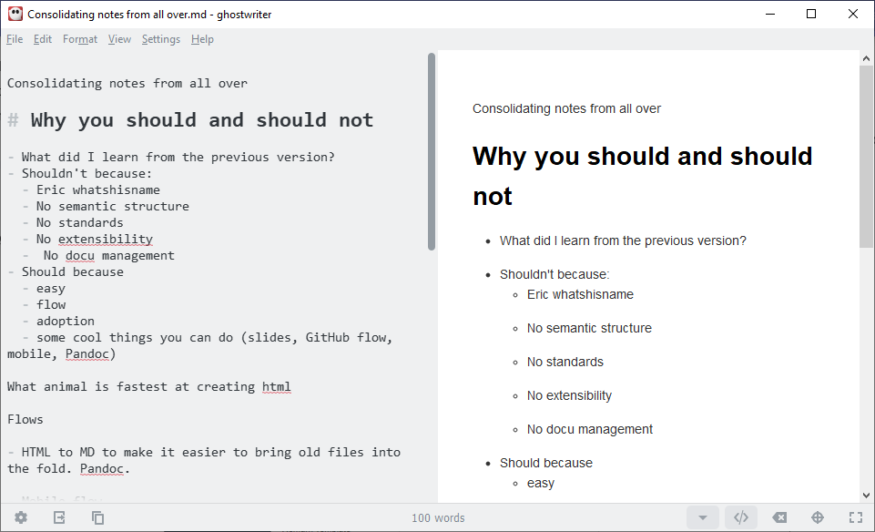
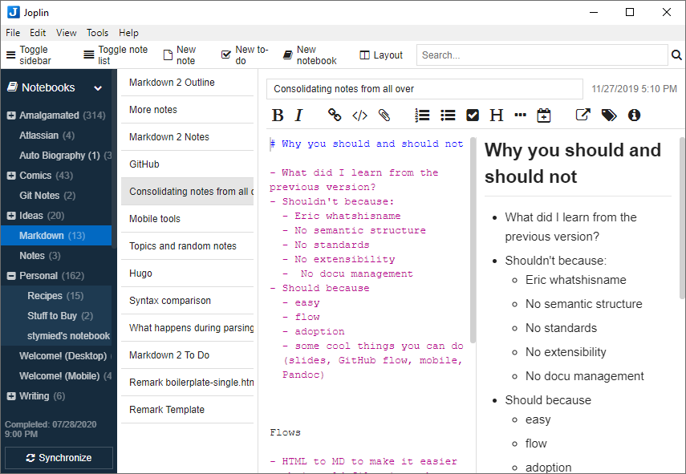
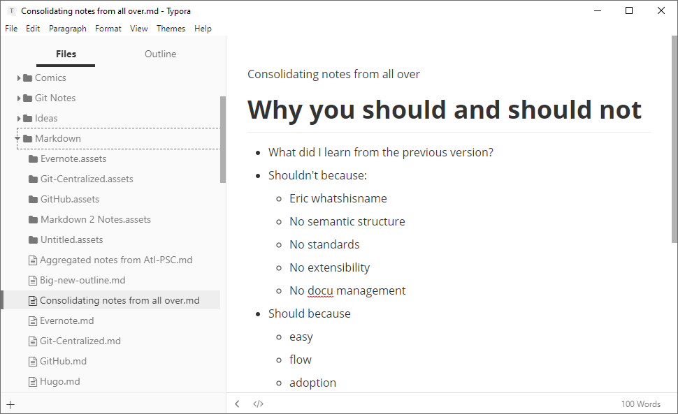
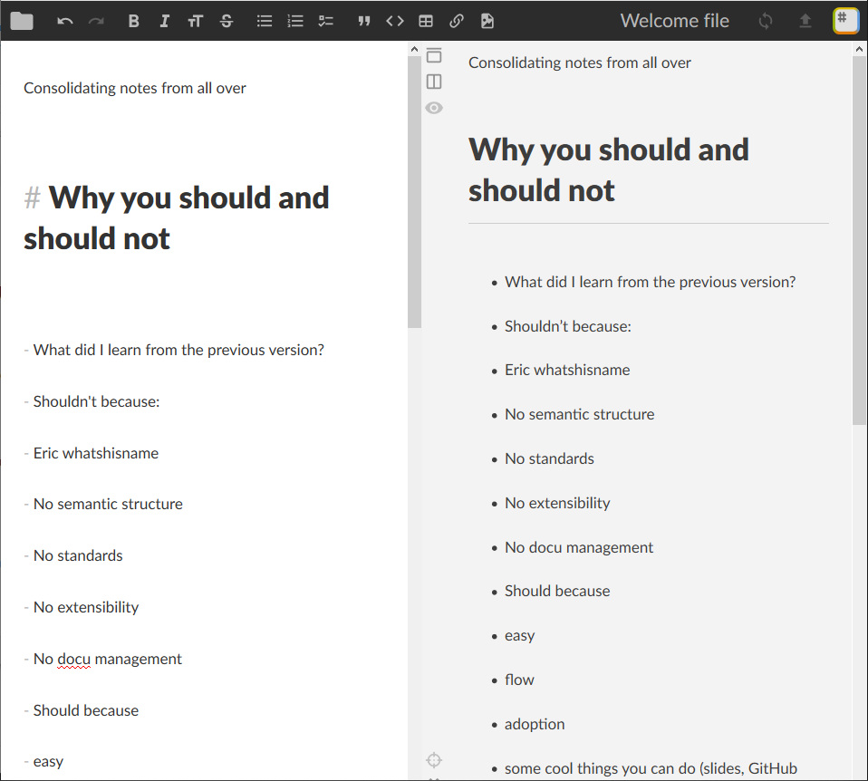

# Markdown editors

There are plenty of Markdown tools available:

- [Dedicated Markdown editors](#dedicated-markdown-editors) usually let you write and
  edit Markdown code with syntax highlighting, and often have a preview pane or separate
  preview window.
- [Code editors](#code-editors) can be quite extensible and sophisticated, offering 
  plugins and packages that provide many of the capabilities of a dedicated Markdown 
  editor.
- [Text editors](#text-editors) are often more general-purpose than dedicated Markdown
  editors, and may or may not offer Markdown syntax highlighing or preview.
- [Browser-based tools](#browser-based-tools) range from simple Markdown preview tools
  to full-featured writing and publishing tools that integrate with source control,
  blogging, or collaboration websites

For blogging, you can get away with a browser-based tool&mdash;in fact, some blogging sites support Markdown already. If you plan to create and manage documentation or other complex writing projects, it makes sense to install a dedicated Markdown editor. If you are adding Markdown to your code development environment, several code editors support Markdown very nicely. 

I have used Joplin and iA Writer, but I use Typora and Ghostwriter most often. 

## Dedicated Markdown editors

Most dedicated editors are designed so that you edit the Markdown directly, with syntax highlighting to make it easier to see that's going on. That's kind of the original intention behind Markdown, after all: to provide formatting tools that are easy to read and don't require you to lift your fingers from the keys. Two tools in particular stand out:

- Joplin, a specialized editor for writing notes and to-do lists
- Typora, an elegant WYSIWYG editor for Markdown

For general purposes, many of these editors are fairly similar, differing in a few features.

### Byword

[Byword](https://bywordapp.com/) (macOS/iOS) provides syntax highlighting and an in-app preview, letting you exprt to a few formats or publish directly to Medium, WorkPress, Blogger, Tumblr, and Evernote.

### Caret

[Caret](https://caret.io/) (macOS/Windows/Linux) offers interesting features such as a folders/files view, multiple cursors, keyboard-based selection tools, and smart help with tables and other formatting features. 

### Ghostwriter

[Ghostwriter](https://wereturtle.github.io/ghostwriter/) (Windows/Linux) is a free and open source split-screen editor that integrates with Pandoc and offers smaller "heads-up display" windows that provide document information and a Markdown cheat sheet.
	
### iA Writer

[iA Writer](https://ia.net/writer) (macOS/iOS/Android/Windows) is intended for writers who want to focus. It integrates with Dropbox, provides the expected preview capabilities, and imports and exports to Microsoft Word.

### Joplin

[Joplin](https://joplinapp.org/) (macOS/iOS/Android/Windows/Linux)is an open-surce note-taking and to-do application that syncs to DropBox, OneDrive, and other cloud storage. It includes its own editor, but also supports the external editor of your choice. It supports end-to-end encryption and can import Evernote notebooks.

### MacDown

[MacDown](https://macdown.uranusjr.com/) (macOS) is an open source Markdown editor with a split screen and live preview, inspired by an early Markdown editor called [Mou](http://25.io/mou/).

### Typora

[Typora](https://typora.io/) (macOS, Windows, Linux) is a Markdown editor that includes not only a syntax editing mode but a fully WYSIWYG editing experience. It integrates with Pandoc, so it can import and export a number of formats. Typora offers a files and folders view, which means it can be used for longer documents or as a note-taking application.

## Code editors

If you are documenting code in a large organization, you might need to write Markdown that meets fairly stringent standards to work with your documentation management and publishing system. Code editors, while they are not designed specifically for Markdown, sometimes offer sophisticated packages to support Markdown editing and preview. An advantage of a code editor is the ability to do things like jump to a specific line number or set text wrapping rules. The following editors, among others, are worth a look:

- [Atom](https://atom.io/)
- [Sublime Text](https://www.sublimetext.com/) 
- [Visual Studio Code](https://code.visualstudio.com/)

## Text editors

Because Markdown is just plain text, even the simplest text editor can be a capable tool. Some well-established text editors offer Markdown modes:

- [BbEdit](https://www.barebones.com/products/bbedit/bb)
- [Emacs](https://www.gnu.org/software/emacs/)
- [Vim](https://www.vim.org/)

## Browser-based tools

Browser-based Markdown tools can be an easy, portable way to write Markdown that you intend to publish to a blog. Some integrate directly with Git hosts, blogging sites, or cloud storage.

### Dillinger

[Dillinger](https://dillinger.io/) is an open source online Markdown editor that integrates with DropBox, GitHub, Google Drive, and OneDrive. You can also import from BitBucket, or from Markdown or HTML files from your computer.

### HackMD

[HackMD](https://hackmd.io/) is an online Markdown editor, free for personal use, that integrates with GitHub and includes tooks for creating [slides](https://hackmd.io/c/tutorials/%2Fs%2Fhow-to-create-slide-deck).

### StackEdit

[StackEdit](https://stackedit.io/) is a full-featured Markdown editor that syncs with DropBox, GitHub, GitLab, and Google Drive. You can import Markdown and HTML files, export with Pandoc, and publish to Blogger, Wordpress, and Zendesk.

### Markdown Dingus
 
[Markdown Dingus](https://daringfireball.net/projects/markdown/dingus) shows how John Gruber's official version of Markdown renders to HTML.

### Babelmark

[Babelmark](https://babelmark.github.io/) is a useful tool for comparing the way different implementations and flavors render Markdown. If you are trying to figure out whether you have a problem in your Markdown or are merely using a feature that's not supported in the Markdown flavor you're using, Babelmark can help.

