# Git basics

This page has the workflows and commands you'll use in the recipes, and some hints to get you out of trouble. 

!!! hint
    It might not be worth it to read through this page all the way through. Just 
    refer to the parts you need. The recipes link to them.

## Workflows

Two workflows we'll talk about:

- [Git Centralized Workflow](../../recipes/recipes-centralized-workflow/): all work is done in a single branch
- [GitHub Flow](../../recipes/recipes-gitflow/): different pieces of work are done in different branches

#### Centralized workflow

- [Edit a Git wiki](../../recipes/recipes-git-wiki)
- [Collaborate using centralized Git workflow](../../recipes/recipes-centralized-workflow)

--8<-- "centralized-workflow-snippet.html"


#### GitHub flow

- [Managing docs with GitHub flow](/recipes/recipes-gitflow/)

<!--

    Pull from the right branch (fixing any merge conflicts).
    Work on your files in the right branch.
    Add your changes and commit every time you get to a good checkpoint.
    Pull, merge, and push to the right branch when it’s time for other people to see your work.

-->

--8<-- "github-flow-snippet.html"

<!--
1. [**Pull**](../../getting-started-getting-started-git-basics/#pull) from master.
2. [**Create a new branch**](#create-a-new-branch) for working on this task.
3. Work on content, using your favorite Markdown editor.
4. From time to time, [**Stage and commit**](../../getting-started/getting-started-git-basics/#stage-and-commit) your changes.
5. If others are pushing, you can [**Pull**](../../getting-started-getting-started-git-basics/#pull) while on your branch to get things that were merged to master.
5. When you want to make your work visible to others, [**Push**](../../getting-started/getting-started-git-basics/#push) to your working branch on the remote repository.
6. When your work is ready, [**Create a pull request**](#create-a-pull-request) and have your work reviewed. Reviews and approvals happen online at your Git host. If there's more work to do before final approval, you can repeat these steps as needed:
   1. Work on the content
   2. Stave and commit
   3. Push&mdash;it should automatically push to the existing pull request. 
7. Once your work is approved, [**Merge**](#approve-and-merge) your branch into master on the remote.
-->

!!! hint
    After you're done with that part of the project, you can delete your working branch
    or keep it around for further work. Before starting work on a different part of the
    project, remember to switch to `master` and pull again.

## How to Git

There's more than these, but here are the steps you'll use in those workflows.

### Pull

The Git pull command fetches and downloads content from your remote repository, automatically merges the changes with your local repository, and updates everything so that your repository matches the latest version of everything on the remote. It's a good idea to pull after making sure you're on the right branch and before starting to work on the content. 

=== "Sourcetree"

    1. Make sure you're on the right branch in the correct repository:
        - The bold text under **Branches** tells you the branch
        - The tab at the top of the screen tells you the repository
    1. Select **Repository > Pull** or click the **Pull** button.  
       

=== "GitHub Desktop"

    In GitHub Desktop, you can *fetch* and *pull* separately. Fetch gets the latest
    updates from origin but doesn't update your local working copy
    with the changes. After you click **Fetch origin**, the button changes to 
    **Pull Origin**.
    
    1. Make sure you're on the right branch in the correct repository:
        - The bold text under **Current branch** tells you the branch
        - The bold text under **Current repository** tells you the repository
    1. Select **Repository > Pull** or:  
        1. Click the **Fetch origin** button.  
             
        1. Click the **Pull origin** button.  
             

=== "Linux command line"
    1. Make sure you're on the right branch in the correct repository:
    ```
    $ git branch
    * master
    $ git remote -v
    origin	https://github.com/pconrad-fb/markdown.git (fetch)
    origin	https://github.com/pconrad-fb/markdown.git (push)
    ```
    1. Type the `git pull` command:
    ```
    $ git pull
    ```

### Stage and commit

Git knows when you make changes to your files. When you want to save those changes to Git, you must do two things:

- *stage* them, which tells Git which changes you intend to keep
- *commit* them, which saves the changes.

=== "Sourcetree"
    In Sourcetree, you stage and commit your files in two operations.
    
    1. Make sure you're on the right branch in the correct repository.
    1. Look for the files you changed in the Unstaged files pane. Select
       the files you want to stage&mdash;in most cases, you can just click 
       **Stage All.**  
       
    1. Make sure you see the right files in the Staged files pane.  
       
    1. Type a short commit message and click **Commit**.  
       

=== "GitHub Desktop"
    In GitHub Desktop, you can stage and commit your files in one step.
    
    1. Make sure you're on the right branch in the correct repository.
    1. Look for the files you changed in the Changes tab. Unselect any files you don't
       want to change&mdash;most of the time, you can leave all the checkboxes checked.  
       
    1. Type a short commit message.
    1. Make sure the **Commit** button refers to the correct branch
       ("Commit to master," for example).
    1. Click **Commit to [branch]**.

=== "Linux command line"
    You can stage, commit and add a commit message all in one line.
    
    1. Make sure you're on the right branch in the correct repository.
    1. Stage and commit the changes, adding a descriptive message:
    ```
    $ git commit -am "Type your descriptinve message here."
    ```

### Push

=== "Sourcetree"
    
    1. Make sure you're on the right branch in the correct repository.  
    1. Select **Repository > Push** or click the **Push** button.  
       


=== "GitHub Desktop"
     
    1. Make sure you're on the right branch in the correct repository.
    1. Select **Repository > Push** or click the **Push origin** button.  
       

=== "Linux command line"

    1. Make sure you're on the right branch in the correct repository.
    1. Push, specifying the remote (usually `origin`) and the branch. For the 
       recipes where you are working on the master branch, the command looks
       like this:
       ```
       $ git push origin master
       ```
       Of course, since git knows what branch you're on and where your remote is, you
       can often just type ``git push`.


### Create a branch

=== "Sourcetree"
    

    1. [**Pull**](../../getting-started-getting-started-git-basics/#pull) from master.
    1. Click the **Branch** button:  
       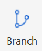
    2. Type a descriptive name and click **Create Branch**.  
       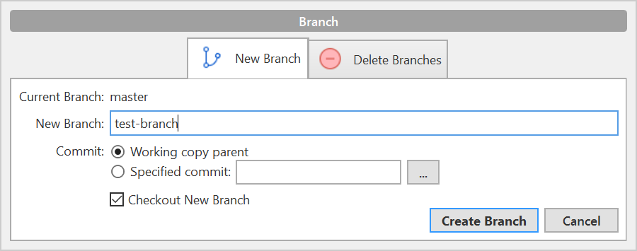
    3. Look under **Branches** to see that you're on the new branch.
    
    You can switch to a different branch by clicking it in the list of branches.
   

=== "GitHub Desktop"
     

    1. [**Pull**](../../getting-started-getting-started-git-basics/#pull) from master.
    1. Click the **Current branch** tab and click **New branch**:  
       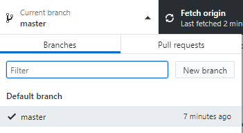
    1. Type a descriptive name and click **Create branch**:  
       
    1. Click **Publish branch**:  
       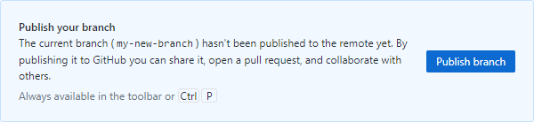
    3. Look under **Branches** to see that you're on the new branch.

    You can switch to a different branch by clicking it in the list of branches.

=== "Linux command line"

    1. Pull from master to make sure you have the latest changes:
        ```
        $ git checkout master
        Already on 'master'
        Your branch is up to date with 'origin/master'.
        $ git pull
        Already up to date.
    
        ```
    1. Create a new branch and switch to it with `git checkout -b`. Example:
        ```
        $ git checkout -b test-branch 
        Switched to a new branch 'test-branch'
        ```
        
    You can switch to any existing branch by typing `git checkout 
    <branch-name>` without the `-b`. Example:
    ```
    $ git checkout -b test-branch 
    Switched to branch 'test-branch'
    ```
    

!!! hint
    You can't switch branches with uncommitted changes. You have to commit before
    switching to a new branch.
    
### Create a pull request

These instructions assume that if you're using Sourcetree, you're storing your repo in Bitbucket; if you're using GitHub Desktop, you're storing your repo in GitHub. It's often better that way because the tools are designed to work togeyther. If you're mixing and matching (or using one of those hosts from the Linux command line) you might have to mix and match your instructions too.

=== "Bitbucket and Sourcetree"

    1. Click **Repository > Create pull request**.
    1. In the dialog that appears, click **Create Pull Request On Web**:  
       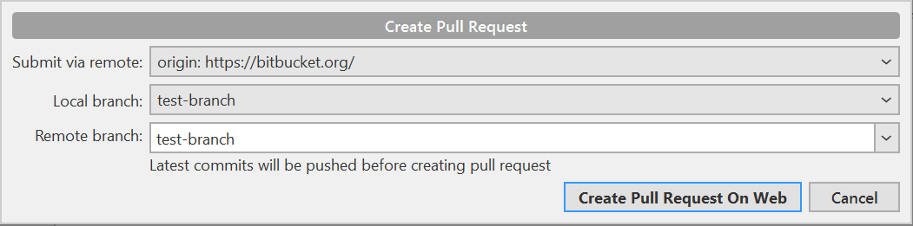
    1. Type a description, add reviewers, and click **Create pull request**:  
       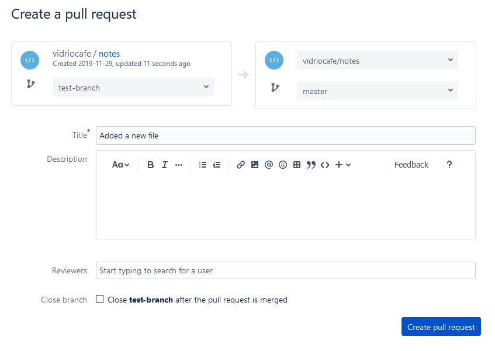


=== "GitHub and GitHub Desktop"

    1. When you push, the banner with the Push button changes "Create a pull
       request from your current branch." Click **Create Pull Request**:  
       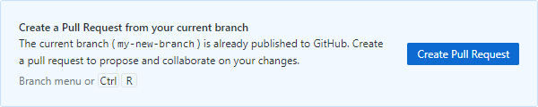
    1. The browser opens a page with a form for creating a pull request:
       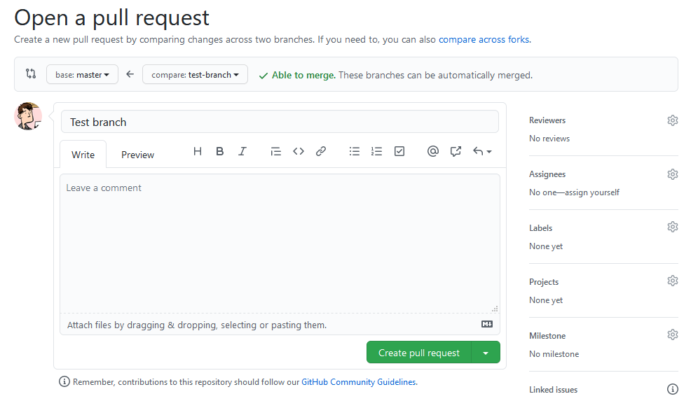
    1. Click the gear next to **Reviewers** to add reviewers:  
       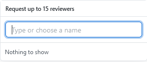
    1. Click **Create pull request**.

=== "Linux command line"

    1. Take a look at the output from the `push` command:
    ```
    $ git push origin test-branch 
    Enumerating objects: 14, done.
    Counting objects: 100% (14/14), done.
    Delta compression using up to 4 threads
    Compressing objects: 100% (10/10), done.
    Writing objects: 100% (10/10), 4.39 KiB | 1.10 MiB/s, done.
    Total 10 (delta 2), reused 0 (delta 0)
    remote: Resolving deltas: 100% (2/2), completed with 1 local object.
    remote: 
    remote: Create a pull request for 'test-branch' on GitHub by visiting:
    remote:      https://github.com/pconrad-fb/markdown/pull/new/test-branch
    remote: 
    To https://github.com/pconrad-fb/markdown.git
     * [new branch]      test-branch -> test-branch
    ```
    2. Copy the URL from the line after `Create a pull request` into a browser.
    3. Follow the instructions on screen. If you get stuck, you can see some hints in the other tabs.

### Approve and merge

Merge your branch online in the web interface of your Git host.

=== "Bitbucket"
    

    1. When your pull request is sufficiently approved, click **Merge**:
       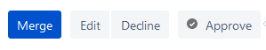

=== "GitHub"
     

    1. When your pull request is sufficiently approved, click **Merge**:  
       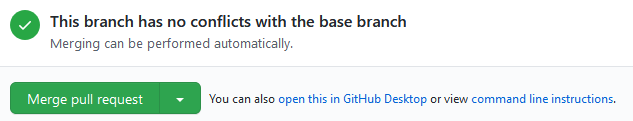

## Getting out of trouble

### Working in the wrong branch

Edited a file in the wrong branch. What you’d like to be able to do is undo those changes, switch branches, then re-do them. Actually, it would be even better to lift those changes off of the wrong branch, laying them gently on top of the branch you meant to be in. Fortunately, Git provides a command called stash that does exactly that.

### Editing the wrong file

Edited a file by mistake. You opened a file to look at it, but then your cat walked across the keyboard. You’re not sure what was added or deleted. You just want to go back to the way things were at the last commit. For this, use checkout.

### Staged too soon
Added too soon. You edited the right file the right way, but then you added it to the staging area too hastily. You don’t want to undo your changes to the file, but you would like to remove it from the next commit. This is one of the uses of reset. You can also use reset to do more drastic rollbacks. You can undo entire commits if you want.
Use your HEAD

### Merge conflicts

Oh, yeah, I haven’t covered merge conflicts. There’s only one thing that ever confused me about them: which part is the change I’m trying to add, and which part is someone else’s change that I’m conflicting with? The answer is a concept that’s central to Git: whenever you see the word HEAD you should imagine it as a sign that says: YOU ARE HERE. The HEAD is the pointer to where you are working—the active commit on the current branch. This concept comes in handy when you're reading the syntax reference for a command like reset.


---
git reflog
# you will see a list of every thing you've
# done in git, across all branches!
# each one has an index HEAD@{index}
# find the one before you broke everything
git reset HEAD@{index}
# magic time machine

You can use this to get back stuff you accidentally deleted, or just to remove some stuff you tried that broke the repo, or to recover after a bad merge, or just to go back to a time when things actually worked. I use reflog A LOT. Mega hat tip to the many many many many many people who suggested adding it!


Oh shit, I committed and immediately realized I need to make one small change!

# make your change
git add . # or add individual files
git commit --amend --no-edit
# now your last commit contains that change!
# WARNING: never amend public commits

This usually happens to me if I commit, then run tests/linters... and FML, I didn't put a space after an equals sign. You could also make the change as a new commit and then do rebase -i in order to squash them both together, but this is about a million times faster.

Warning: You should never amend commits that have been pushed up to a public/shared branch! Only amend commits that only exist in your local copy or you're gonna have a bad time.


Oh shit, I need to change the message on my last commit!

git commit --amend
# follow prompts to change the commit message

Stupid commit message formatting requirements.
Oh shit, I accidentally committed something to master that should have been on a brand new branch!

# create a new branch from the current state of master
git branch some-new-branch-name
# remove the last commit from the master branch
git reset HEAD~ --hard
git checkout some-new-branch-name
# your commit lives in this branch now :)


Oh shit, I need to undo my changes to a file!

# find a hash for a commit before the file was changed
git log
# use the arrow keys to scroll up and down in history
# once you've found your commit, save the hash
git checkout [saved hash] -- path/to/file
# the old version of the file will be in your index
git commit -m "Wow, you don't have to copy-paste to undo"

When I finally figured this out it was HUGE. HUGE. H-U-G-E. But seriously though, on what fucking planet does checkout -- make sense as the best way to undo a file? :shakes-fist-at-linus-torvalds:


https://dangitgit.com/en