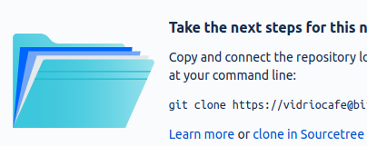

# Git setup

<!--
TO Do

Talk about why we're doing each step
What do we end up with?
Add GitHub steps and Linux command line
-->
Here's what ya do

## Install Git

If you don't already have Git set up on your computer, follow these steps.

1. Install Git on your computer:
    - [Windows](https://git-scm.com/download/win)
    - [macOS](https://git-scm.com/download/mac)
    - [Linux](https://git-scm.com/download/linux)
1. Install a git client such as  [Sourcetree](https://www.sourcetreeapp.com/).

!!! hint
    You can use any Git client with any Git host, but some clients work especially well
    with specific hosts. For example:
    
    - Sourcetree and Bitbucket
    - GitHub Desktop and GitHub

## Set up a repository

A *repository* is where you keep your work. There are many approaches to creating a repository. One easy way is to create the repository online  and *clone* it (create a local copy). The steps are similar for different Git hosts and clients. Here is what those steps look like in Bitbucket and Sourcetree:

1. Sign up with a Git host such as [Bitbucket](https://bitbucket.org/).
2. In a browser, log on to Bitbucket (or your preferred host).
2. Click the new repository button (the plus sign):  
   
3. Type a repository name, make sure it's set to be a public repository, and 
   click **Create repository**.
4. Choose or create a directory on your computer where you would like to keep your local 
copy of the project.
5. Click **Clone in Sourcetree**.  
   
6. Make sure the correct repository is going to the correct folder on your computer,
   and click **Clone**.

It might not look like much has happened, but you now have:

- Git running on your computer
- A repository at an online Git host
- A local copy of the repository on your computer

## Next steps

- Take a look at [Git basics](../getting-started-git-basics/)
- Try setting up a [Git wiki](../../recipes/recipes-git-wiki).