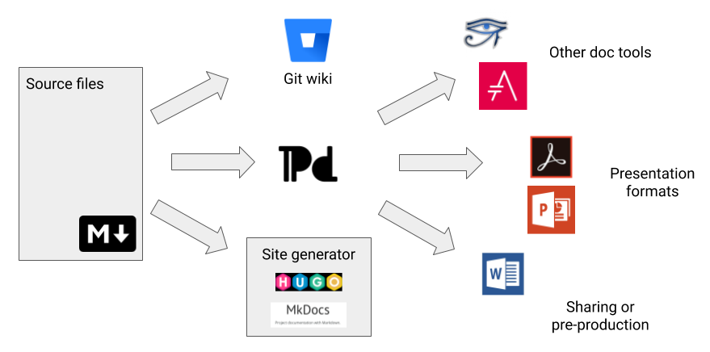

# Publishing tools

There are many tools that can take your Markdown to your audience or just convert them for use in other doc tools. We'll focus the Git wiki, the static site generators Hugo and MkDocs, and Pandoc. We'll also touch on tools for creating standalone presentations.



## Git wiki

A Git wiki is a special additional repository attached to your Git code repository. You create and clone a git wiki separately from your main repository. 

### Git wiki structure

A Git wiki uses folders to organize files. The path to a file is used to create the URL where the content is displayed.

A simple directory structure might look like this:

```
Home.md
stuff/
    something.md
```

In that case, the URL to the content in `something.md` is: **/wiki/stuff/something**

See also:

- [Edit a Git wiki](../../recipes/recipes-git-wiki/)


## Hugo

[Hugo](https://gohugo.io/) is an open-source static site generator that includes templates and provides exensibility in the form of *shortcodes,* which provide additional formatting. You can even create your own shortcodes.

See also:

- [Publish a website with Hugo](../../recipes/recipes-hugo/)

## MkDocs

[MkDocs](https://www.mkdocs.org/) is a static site generator that turns directories of Markdown files into a searchable, presentable website. Customizable themes, many of them provided by the community, provide Markdown extensions for reusing content and for formatting such as tabs and admonitions. 

See also:

- [Publish documentation with MkDocs](../../recipes/recipes-mkdocs/)

## Pandoc

[Pandoc](https://pandoc.org/) is a tool that can convert between Markdown and a number of formats. You can use Pandoc to create Word and Powerpoint documents, PDFs, HTML, and standalone slide presentations that work with tools like DZslides. For longer documents, Pandoc has options for concatenating Markdown files together.

Pandoc includes formatting tricks that let you do things like create columns or scale images, and can use stylesheets from existing documents to give your content a specific look and feel.

You can also convert from various formats to Markdown, including dong things like grabbing a web page as a Markdown file. You can even [try it online](https://pandoc.org/try/).

See also:

- [Create a Word document](../../recipes/recipes-pandoc-word/)
- [Create an eBook](../../recipes/recipes-pandoc-ebook/)
- [Create a PDF](../../recipes/recipes-pandoc-pdf/)
- [Grab a web page](../../recipes/recipes-pandoc-web/)
- [Create a Powerpoint presentation](../../recipes/recipes-slides/)
- [Create a DZSlides presentation](../../recipes/recipes-slides-dzslides/)

## FTP

When you create a website with Hugo or MkDocs, you'll use FTP to upload the files to the web. You can do this from the command line, but it's much easier to choose an application that gives a nice UI and lets you save bookmarks. Here are a few:

- [FileZilla](https://filezilla-project.org/) - a free, open source FTP tool for macOS
  and Windows
- [gFTP](https://en.wikipedia.org/wiki/GFTP) - the default Linux option
- [Transmit](https://panic.com/transmit/) - a commercial app for macOS

## Presentation tools

Here are two tools that you can use for in-browser presentations.

### DZSlides

[DZSlides](http://paulrouget.com/dzslides/) is a single page, HTML-based slide presentation template. Pandoc can generate a DZSlides presentation from a Markdown file.

See also:

- [Create a DZSlides presentation](../../recipes/recipes-slides-dzslides/)

### Remark

[Remark](https://remarkjs.com/#1) is an in-browser presentation tool made from Javascript, HTML, CSS, and, of course, Markdown. The slideshow lives in a `<textarea>` tag where you can add and edit Markdown directly.

See also:

- [Create a Remark presentation](../../recipes/recipes-slides-remark/)


## Other tools

If you are converting Markdown to a format such as Word, PDF, or ePub, it can be useful to have editing tools to help you fix any problems in the final result:

- [Acrobat](https://get.adobe.com/reader/) - the original PDF reader
- [LibreOffice](https://www.libreoffice.org/) - an open-source office suite
- [Microsoft Office](https://www.office.com/) - an office suite that includes Word and PowerPoint
- [Sigil](https://sigil-ebook.com/) - a multi-platform ePub editor