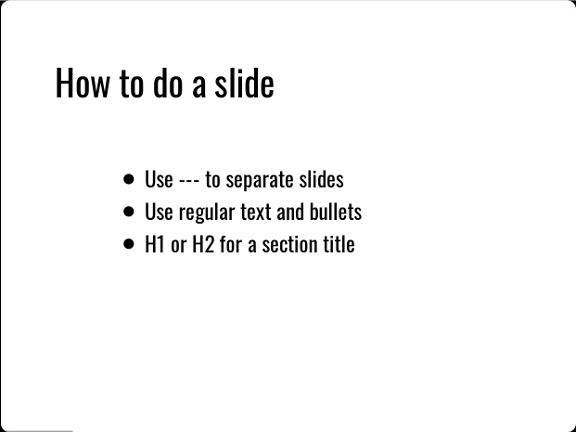
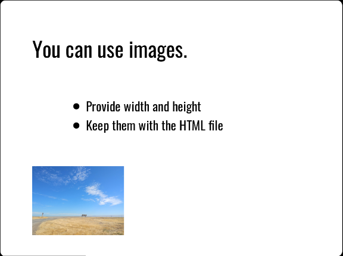

# Create a DZSlides presentation


## Ingredients

<table>
  <tr>
    <td><b><a href="../../tools/tools-editors/">Markdown editor</a></b></td>
  </tr>
  <tr>
    <td><b><a href="../../tools/tools-publishing/#pandoc">Pandoc</a></b></td>
  </tr>
</table>


## DZslides

If you want to do one of those slick presentations with big images and very few words, DZslides is an easy way to do it.

Here’s some sample Markdown:

```
---

# H1 or H2 is a Section Title

---

Normal Text for Slide Title

- Bullet
- Bullet

---
```

DZslides uses an H1 or H2 as a section header, which you will probably mostly have on a slide by itself. Normal text is big enough for a title or announcement on a slide.



The layout of slides in DZslides is bold and simple; you probably won’t find yourself using tables or columns a lot.

Once you have created your slides in Markdown, build them with Pandoc:

pandoc -t dzslides -s myslides.md -o myslides.htm

The -s option tells Pandoc to create a standalone presentation, including all the CSS, HTML, and JavaScript needed to display it. You can view the resulting HTML file in a browser.



Remember, since it’s HTML, you need to keep the images and the presentation together. If you copy your presentation to a thumb drive without the images, you will be unhappy. It’s a good idea to create the Markdown presentation in a folder with all the images it needs, make sure it works in your favorite Markdown editor’s preview mode, then use Pandoc to build the presentation in the same folder. You can copy the folder wherever you need it, knowing that all the images are there.

